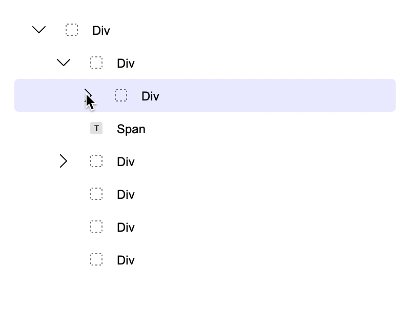

# React Tree List


A draggable & sortable tree list UI component for React.

|  |
| ------------------------------------------------------------------------------------------------------------------- |

[Demo](https://bartaxyz.github.io/react-tree-list/)
&nbsp;&middot;&nbsp; [See Features](https://github.com/bartaxyz/react-tree-list/projects)
&nbsp;&middot;&nbsp; [Request Feature](https://github.com/bartaxyz/react-tree-list/issues)

## Usage

### Installation with NPM

```bash
npm install @bartaxyz/react-tree-list
```

This package additionaly requires you having `react` and `react-dom` dependencies.

### Importing

You can import the component directly as `ReactTreeList`

```js
import { ReactTreeList } from "@bartaxyz/react-tree-list";
```

#### Typescript

For Typescript the imports additionaly include types like `ReactTreeListProps` which is a type of properties
for `ReactTreeList` component.

```ts
import { ReactTreeList, ReactTreeListProps } from "@bartaxyz/react-tree-list";
```

### Simple Example

This is a simple implementation with some items (one nested item) and defaults for each of the items.

```tsx
import React, { useState } from "react";
import { ReactTreeList } from "@bartaxyz/react-tree-list";

const Component = () => {
  const [data, setData] = useState([
    {
      id: "1",
      label: "Item #1",
      open: true,
      children: [{ label: "Item #2" }],
    },
    {
      id: "2",
      label: "Item #3",
    },
  ]);

  const onTreeListChange = (data) => {
    setData(data);
  };

  const onTreeListSelected = (item) => {
    console.log("choosed item =", item);
  };

  return (
    <ReactTreeList
      data={data}
      onChange={onTreeListChange}
      itemDefaults={{ open: false, arrow: "▸" }}
      selectedId="1"
      onSelected={onTreeListSelected}
    />
  );
};
```

### Simple Style Customisation

There's a limited possibility to adjust the styles (background color, outline color, border radius, etc.) of the focused items using the `itemOptions` property.

```tsx
const Component = () => {
  ...

  return (
    <ReactTreeList
      ...
      itemOptions={{
        focusedOutlineColor: "rgba(255, 0, 0, 0.5)",
        focusedOutlineWidth: 1,
        focusedBorderRadius: 50,
        focusedBackgroundColor: "rgba(255, 0, 0, 0.1)",
      }}
    />
  );
}
```

[Storybook - Tree List With Custom Styles](https://bartaxyz.github.io/react-tree-list/?path=/story/tree-list--with-custom-styles)

### [See Advanced Examples](https://bartaxyz.github.io/react-tree-list)

## License

React Tree List is licensed under the MIT License.

## Authors

Ondřej Bárta · [website](https://www.ondrejbarta.xyz) · [twitter](https://twitter.com/bartaxyz)

## Contributors

张威 (zhangwei900808) · [GitHub](https://github.com/zhangwei900808)
